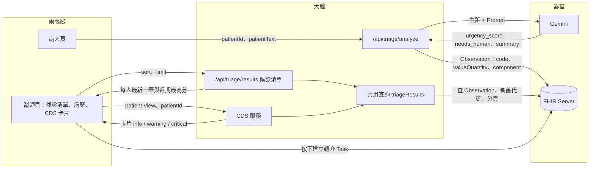

```mermaid

flowchart LR
  subgraph faces[兩張臉]
    P["病人頁"]
    D["醫師頁：候診清單、病歷、CDS 卡片"]
  end
  subgraph brain[大腦]
    T["/api/triage/analyze"]
    L["/api/triage/results 候診清單"]
    C["CDS 服務"]
    S["共用查詢 triageResults"]
  end
  subgraph organs[器官]
    G["Gemini"]
    F[("FHIR Server")]
  end
  P -->|patientId、patientText| T
  T -->|主訴 + Prompt| G
  G -->|urgency_score、needs_human、summary| T
  T -->|Observation：code、valueQuantity、component| F
  D -->|sort、limit| L
  D -->|patient-view、patientId| C
  L --> S
  C --> S
  S -->|查 Observation，新舊代碼、分頁| F
  L -->|每人最新一筆與近期最高分| D
  C -->|卡片 info / warning / critical| D
  D -->|按下建立轉介 Task| F

```