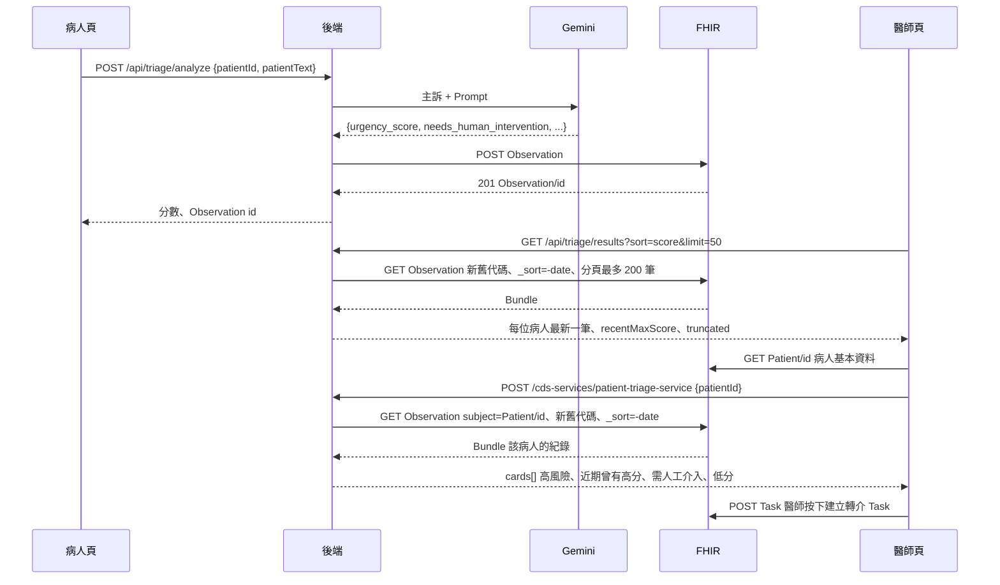

```mermaid

sequenceDiagram
    participant 病人頁
    participant 後端
    participant Gemini
    participant FHIR
    participant 醫師頁

    病人頁->>後端: POST /api/triage/analyze {patientId, patientText}
    後端->>Gemini: 主訴 + Prompt
    Gemini-->>後端: {urgency_score, needs_human_intervention, ...}
    後端->>FHIR: POST Observation
    FHIR-->>後端: 201 Observation/id
    後端-->>病人頁: 分數、Observation id

    醫師頁->>後端: GET /api/triage/results?sort=score&limit=50
    後端->>FHIR: GET Observation 新舊代碼、_sort=-date、分頁最多 200 筆
    FHIR-->>後端: Bundle
    後端-->>醫師頁: 每位病人最新一筆、recentMaxScore、truncated

    醫師頁->>FHIR: GET Patient/id 病人基本資料
    醫師頁->>後端: POST /cds-services/patient-triage-service {patientId}
    後端->>FHIR: GET Observation subject=Patient/id、新舊代碼、_sort=-date
    FHIR-->>後端: Bundle 該病人的紀錄
    後端-->>醫師頁: cards[] 高風險、近期曾有高分、需人工介入、低分
    醫師頁->>FHIR: POST Task 醫師按下建立轉介 Task

```